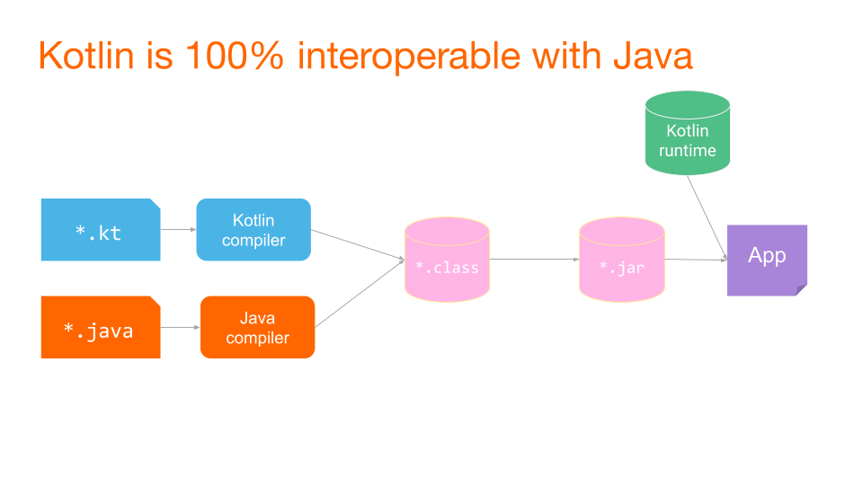

# Знайомство з Kotlin та базовим синтаксисом

## Загальна інформація про мову

Kotlin - **статично типізована**, об'єктно-орієнтована мова програмування (з підтримкою процедурного програмування), що працює поверх Java Virtual Machine і розробляється компанією JetBrains. Також компілюється в JavaScript і у виконуваний код низки платформ через інфраструктуру LLVM. Мова названа на честь острова Котлін у Фінській затоці.

Основні можливості та переваги Kotlin:

- компілюється в байткод JVM або в JavaScript
- програми можуть використовувати всі наявні Java-фреймворки та бібліотеки. Kotlin можна інтегрувати з Maven, Gradle та іншими системами збірки проєкту
- мова проста для вивчення
- вихідний код відкритий
- мова null-безпечна

Оскільки Kotlin був спочатку спроєктова як JVM-мова, повністю сумісна з Java і навпаки, ви без зусиль можете успадковуватися від існуючих Java-класів, звертатися до них і застосовувати Java-анотації до ваших Kotlin-класів і методів.
Перш за все, IntelliJ компілює код Kotlin, використовуючи компілятор kotlinc-jvm. Це означає, що IntelliJ транслює код на Kotlin у байт-код, мову, якою "розмовляє" JVM.

<p align="center">
  
</p>

## Базовый синтаксис

Створимо новий Kotlin-файл та додамо наступний код

```kotlin
package ua.opnu.kotlin.tst

fun main() {
    println("Hello, world!")
}
```

Прежде всего, нужно разобраться со строчкой

```kotlin
package ua.opnu.kotlin.tst
```

Як і в Java, у мові Kotlin файли та класи об'єднуються в пакети. Функціональність пакетів в обох мовах ідентична, за винятком того, що в Kotlin не обов'язково (але вкрай бажано), щоб пакети повторювали структуру директорій на диску.

Як і в Java, для запуску проекту нам необхідно створити точку входу - метод `main()`.

У Kotlin функція `main()` має дві можливі сигнатури

```kotlin
package example

// Перша сигнатура
fun main(args: Array<String>) {
    println("Hello, Kotlin!")
}

// Друга сигнатура
fun main() {
    println("Hello, Kotlin!")
}
```

Перше, що ми можемо помітити, - ключове слово `fun`, яким у Kotlin позначаються **функції**.

На відміну від Java, в якій використовується термін **метод**, в Kotlin використовується термін **функція**. Це пов'язано з тим, що згідно з ідеологією мови Java, весь виконуваний код знаходиться всередині класів. Таким чином, у Java немає функцій поза об'єктом того чи іншого класу (питання статичних функцій залишимо осторонь).

У мові Kotlin підтримується механізм функцій верхнього рівня (top-level functions).

**Поняття "верхнього рівня" (top-level) не варто плутати з поняттям "вищого порядку" (higher-order).**

Функції верхнього рівня - це функції, які визначаються у файлі поза іншими функціями, об'єктами, класами або інтерфейсами, самі по собі, просто всередині пакета.

Але тут криється один нюанс - мова Kotlin має бути сумісною з Java і виконується всередині JVM. Тому "під капотом" замість функції верхнього рівня буде створено клас зі статичним методом.

Створимо файл `MyFile.kt` і всередині нього визначимо функцію `myFunc()`. Код мовою Kotlin матиме такий вигляд

```kotlin
package example

fun myFunc() {
    println("Hello!")
}
```

Тепер виберемо пункт меню `Tools->Kotlin->Show Kotlin Bytecode` і у вікні, що відкрилося праворуч, натиснемо на кнопку `Decompile`, після чого ми побачимо java-код, який буде ідентичний коду на Kotlin з погляду байткоду

```java
public final class MyFileKt {
   public static final void myFunc() {
      String var0 = "Hello!";
      boolean var1 = false;
      System.out.println(var0);
   }
}
```

**Важливо розуміти, що багато "фішок" мови Kotlin існують лише на рівні вихідного коду, для зручності розробника**.

Продовжуємо розбирати вихідний код стартового проєкту. Рядок

```kotlin
fun main(args: Array<String>) {
```

говорить нам про те, що в Kotlin використовується **Pascal notation**, тобто оголошення виду `name: type`. Аргументи відокремлюються один від одного комою.

Масиви в Kotlin моделюються узагальненим класом `Array<T>`. Більш детально ми розглянемо масиви пізніше.

Далі, розглянемо рядок

```kotlin
println("Hello, Kotlin!")
```

Зверніть увагу, що для виклику функції `println()` ми не підключали жодних бібліотек.

Класи та утиліти Kotlin містяться всередині стандартної бібліотеки Kotlin (**Kotlin Standard Library**). Вона містить ключові компоненти мови Kotlin.

У кожен kotlin-файл за замовчуванням імпортуються такі пакети, які входять до стандартної бібліотеки Kotlin:

- `kotlin.*`
- `kotlin.annotation.*`
- `kotlin.collections.*`
- `kotlin.comparisons.*`
- `kotlin.io.*`
- `kotlin.ranges.*`
- `kotlin.sequences.*`
- `kotlin.text.*`

Також, якщо цільовою платформою Kotlin є JVM (як у нашому випадку), то додатково імпортуються такі пакети:

- `java.lang.*`
- `kotlin.jvm.*`

Таким чином, ми можемо використовувати велику кількість готових класів і функцій без необхідності їх явно імпортувати.

Ну й останнє, на що варто звернути увагу - немає потреби ставити `;` після кожної інструкції (є два винятки, але поки що не будемо їх торкатися)

## Типи даних

Головною відмінністю Kotlin від Java в питанні типів даних є те, що **в Kotlin немає примітивних типів** - усе є об'єктом.

У Kotlin існують такі вбудовані групи типів даних:

- numbers
- booleans
- characters
- strings
- arrays

### Цілочисельні типи

Група **numbers** включає цілочисельні типи

- `Byte` (8 біт)
- `Short` (16 біт)
- `Int` (32 біти)
- `Long` (64 біти)

При виведенні типів, якщо цілочисельне значення змінної не перевищує максимальне значення `Int`, то компілятор автоматично виводить тип `Int`. Якщо значення перевищує `Int`, то автоматично виводиться `Long`. Для автоматичного виведення `Long`, вкажіть суфікс `L` після значення.

```kotlin
val one = 1 // Int
val threeBillion = 3000000000 // Long
val oneLong = 1L // Long
val oneByte: Byte = 1
```

### Типи з плаваючою крапкою

Крім цього, група **numbers** включає типи з плаваючою крапкою

- `Float` (32 біт), точність 6-7 знаків після коми
- `Double` (64 біт), точність 15-16 знаків після коми

При виведенні типів, компілятор буде виводити тип `Double`. Для явної вказівки типу `Float`, використовуйте суфікс `F` або `f`.

**ВАЖЛИВО! У Kotlin немає розширювального перетворення чисел, як у Java. Таким чином, якщо в Java наступний код буде працювати коректно**

```java
int a = 5;
long b = 5L;
float c = 5.5f;
double d = 5.5;

foo(a);
foo(b);
foo(c);
foo(d);

void foo(double d) {
    System.out.println(d);
}
```

то в Kotlin корректным будет только последний вызов функции

```kotlin
val a: Int = 5
val b: Long = 5L
val c: Float = 5.5f
val d: Double = 5.5

foo(a) // ПОМИЛКА!
foo(b) // ПОМИЛКА!
foo(c) // ПОМИЛКА!
foo(d) // OK

fun foo(d: Double) {
    println(d)
}
```

Для перетворення одного числового типу в інший використовуйте методи `toXXX()`, які є у всіх числових типах

```kotlin
val num = 5
val longnum: Long = num.toLong()
```

У версії Kotlin 1.5 з'явилася стабільна реалізація **unsigned** цілочисельних типів (`UByte`, `UShort`, `UInt`, `ULong`).

### Булеві типи

Тип `Boolean` представляє булеві об'єкти, які приймають тільки два значення: `true` і `false`. Об'єкти типу `Boolean?` можуть мати значення `null`.

### Символи

Символи представлені в Kotlin типом `Char`. Символьні літерали укладаються в одинарні дужки: `'X'`.

Спеціальні символи починаються з `\`. Підтримуються такі керуючі послідовності: `\t \b \n \r \r \' \" \\ \$`

Якщо символом є цифра, ви можете явно перетворити її в Int за допомогою функції `digitToInt()`

```kotlin
val ch: Char = '5'
val num: Int = ch.digitToInt()
```

### Рядки

Рядки в Kotlin представлені типом `String`. Як правило, строкове значення це послідовність символів, укладених у подвійні лапки `"`

```kotlin
val str: String = "string 1234"
```

Елементи рядка є символами, до яких ви можете отримати доступ за допомогою оператора індексування `str[i]`. Ви можете проітерувати рядок за допомогою циклу `for`

```kotlin
val str: String = "string 1234"
println(str[2])

for (ch in str) {
    println(ch)
}
```

У Kotlin, як і в Java, рядки **незмінні** (immutable).

Для конкатенації рядків можна використовувати оператор `+`. Ви можете склеювати рядки зі значеннями інших типів, якщо першим операндом у виразі буде рядок.

```kotlin
val s = "abc" + 1
println(s + "def") // abc1def
```

#### Рядкові літерали

У Kotlin передбачено два типи строкових літералів:

- рядки з керуючими послідовностями
- сирі (raw) рядки, які можуть бути багаторядковими і містити довільний текст.

Сирі рядки визначаються потрійними лапками `"""`, не містять керуючих послідовностей, можуть бути багаторядковими і містити будь-які символи

```kotlin
val txt = """
    !@##$
    #$#%^
    We watch the shows, we watch the stars
    On videos for hours and hours
    We hardly need to use our ears
    How music changes through the years
    %$^&^*&^*(*
    &(/m/m/m/m/
"""
```

#### Рядкові шаблони

Рядкові літерали можуть містити шаблонні вирази - фрагменти коду, які можна обчислити і результат склеїти з рядком. Шаблонний вираз починається зі знака долара `$` і далі містити ідентифікатор

```kotlin
val i = 10
println("i = $i") // i = 10
```
або вираз у фігурних дужках `{}`

```kotlin
val i = "abc"
println("$i length is ${i.length}") // abc length is 3
```

Ви можете використовувати шаблони і в сирих рядках також. Якщо вам потрібно написати символ `$` у сирому рядку, то слід використовувати такий синтаксис

```kotlin
val price = """
    The price of this item is ${'$'}1.65
    """ // The price of this item is $1.65
```

### Масиви

Масиви в Kotlin представлені класом `Array<T>`. Об'єкти цих класів мають функції `get` і `set`, які не використовуються безпосередньо, а доступ до елементів відбувається через оператор `[]`, а також **властивість** (property) `size`, а також інші корисні функції.

Для створення масивів, використовуйте функцію `arrayOf()` і передавайте їй значення, з якими ви хочете створити масив. Якщо ви хочете створити масив з елементами, що містять `null`, то використовуйте функцію `arrayOfNulls()`.

Інша можливість створення масиву - використати конструктор класу `Array`, який приймає розмір масиву і функцію, що приймає індекс масиву і повертає значення, яке буде поміщено в цей індекс.

```kotlin
val arr = arrayOf(1, 2, 3, 4, 5) // [1, 2, 3, 4, 5]
val arr2 = Array(5, { i -> i * 2 }) // [0, 2, 4, 6, 8]
```

## Змінні

На відміну від Java, де змінні могли бути оголошені всередині методів або блоків коду, а також виступати полями класу

```java
class TestClass {
    private String field;

    static {
        String localvar1 = "123";
    }

    public void foo() {
        String localvar2 = "456";
        if (field == null) {
            String localvar3 = "789";
        }
    }
}
```

у Kotlin усе трохи інакше.

По-перше, поля в Kotlin називаються **властивості** (**property**), відмінності властивості від поля ми розглянемо пізніше. Також у Kotlin ви можете оголошувати **властивості верхнього рівня** (**top-level property**). Вони оголошуються прямо всередині пакета.

```kotlin
package example

val topLevelProperty: String = "1234"
```

Якщо подивитися аналогічний код у Java, то ви побачите таке

```java
public final class MainKt {
   @NotNull
   private static final String topLevelProperty = "1234";

   @NotNull
   public static final String getTopLevelProperty() {
      return topLevelProperty;
   }
}
```

Чому в Java змінна оголошена як `private` і чому там з'явився геттер - дізнаємося трохи пізніше.

Для визначення змінної використовується ключове слово `var` або `val`.

Формальне визначення змінної:

`val|var ім'я_змінної: тип_змінної`

Спочатку йде слово `val` або `var`, потім ім'я змінної і через двокрапку тип змінної. Наприклад

```kotlin
val age: Int
```

Незмінні (тільки для читання) локальні змінні визначаються за допомогою ключового слова `val`. Присвоїти їм значення можна тільки один раз

```kotlin
val a: String = "1234"
a = "5678" // ПОМИЛКА
```

Змінювані змінні оголошуються за допомогою ключового слова `var`.

```kotlin
var a: String = "1234"
a = "5678" // OK
```

### Виведення типу

Kotlin дозволяє виводити тип змінної на підставі даних, якими змінна ініціалізується. Тому під час ініціалізації змінної тип можна опустити

```kotlin
fun main() {
    val i = 5 // Int
    val d = 5.5 // Double
    val s = "1234" // String
    val mc = MyClass() // MyClass
}
```

Важливо розуміти, що механізм виведення типу працює тільки в тому випадку, якщо компілятор може встановити тип змінної. Наприклад, такий код призведе до помилки

```kotlin
fun main() {
    var i // Помилка
    i = 5
}
```

оскільки компілятор не може встановити тип змінної на етапі компіляції.

## Керування потоком

### Умови та цикли

У мові Kotlin `if` є виразом, тобто воно повертає значення. Це дозволяє відмовитися від тернарного оператора.

```kotlin
// Звичайне використання
var max = a
if (a < b) max = b

// з блоком else
var max2: Int
if (a < b) {
    max = a
} else {
    max = b
}

// у вигляді виразу
val max3 = if (a > b) a else b
```

Гілки виразу if можуть бути блоками, тобто містити кілька рядків коду, при цьому останній вираз є значенням блоку:

```kotlin
val max = if (a > b) {
    print("повертаємо а")
    a
} else {
    print("повертаємо b")
    b
}
```

Якщо ви використовуєте `if` як вираз (наприклад, повертаючи його значення або присвоюючи його змінній), то використання його як вираз (наприклад, повертаючи його значення або присвоюючи його змінній), то використання гілки `else` є обов'язковим.

#### Умовний вираз `when`

`when` визначає умовний вираз із кількома "гілками". Він схожий на оператор `switch`, присутній у C-подібних мовах

```kotlin
val x = 5

when (x) {
    1 -> println("x == 1")
    2 -> println("x == 2")
    else -> {
        println("інше значення")
    }
}
```

`when` послідовно порівнює свій аргумент з усіма зазначеними значеннями, поки не виконається будь-яка з умов гілок.

`when` можна використовувати і як вираз, і як оператор. При використанні його у вигляді виразу, значення першої гілки, що задовольняє умові, стає значенням усього виразу. При використанні `when` у вигляді оператора, значення окремих гілок відкидаються. Кожна гілка може бути блоком і її значенням є останній вираз блоку.

Значення гілки `else` обчислюється в тому випадку, коли жодна з умов в інших гілках не була задоволена.

Якщо when використовується як вираз, то гілка else є обов'язковою, за винятком випадків, у яких компілятор може впевнитися, що гілки покривають усі можливі значення. Так відбувається, наприклад, із записами класу enum і з підтипами ізольованих (`sealed`) класів.

```kotlin
enum class Bit {
    ZERO, ONE;
}

fun getRandomBit(): Bit {
    return if (!Random.nextBoolean()) Bit.ZERO else Bit.ONE;
}

fun main() {
    val numericValue = when (getRandomBit()) {
        Bit.ZERO -> 0
        Bit.ONE -> 1
        // 'else' не потрібно, тому що всі випадки враховано
    }
}

```

Якщо `when` виступає як оператор, гілка else обов'язкова:

- якщо `when` має об'єкт типу `Boolean`, `enum`, `sealed` або їхні nullable-аналоги;
- гілки `when` не охоплюють усі можливі випадки для цього об'єкта.

```kotlin
enum class Color {
    RED, GREEN, BLUE;
}

fun main() {
    when(getColor()) {
        Color.RED -> println("RED")
        Color.GREEN -> println("GREEN")
        Color.BLUE -> println("BLUE")
        // else не потрібно, тому що всі випадки враховано
    }

    when(getColor()) {
        Color.RED -> println("RED")
        else -> println("other color") // з версії 1.7 else обов'язковий
    }
}
```

Якщо для кількох значень виконується одна й та сама дія, то умови можна перераховувати в одній гілці через кому

```kotlin
val x = 5

when (x) {
    0, 1 -> println("x equals 0 or 1")
    else -> println("otherwise")
}
```

Крім констант, у гілках можна використовувати довільні вирази

```kotlin
val str = "1234"
val number = 1234

when (number) {
    str.toInt() -> println("str encodes number")
    else -> println("error")
}
```

Також можна перевіряти входження аргументу в інтервал за допомогою функцій `in` або `!in`, або його наявність у колекції

```kotlin
val food = listOf("apple", "pear", "strawberry")

when ("apple") {
    in food -> println("we have an apple")
    else -> println("nope")
}

val x = 5
val validNumbers = arrayOf(1, 3, 5, 7, 11)

when (x) {
    in 1..10 -> println("x in range")
    in validNumbers -> println("x is valid")
    else -> println("nope")
}
```

`when` зручно використовувати замість ланцюжка умов виду `if-else if`. За відсутності аргументу, умови працюють як прості логічні вирази, а тіло гілки виконується за умови його істинності

```kotlin
val x = 5
when {
    x % 2 == 0 -> println("x id even")
    else -> println("x is odd")
}
```

Можна отримувати змінну всередині `when` умови за таким синтаксисом

```kotlin
fun Request.getBody() =
        when (val response = executeRequest()) {
            is Success -> response.body
            is HttpError -> throw HttpException(response.status)
        }
```

У даному випадку, змінна `response`, оголошена всередині умови `when`, може бути видна тільки всередині тіла цього `when`.

### Цикл for

Цикл for забезпечує перебір усіх значень, що постачаються ітератором. Він аналогічний конструкції `foreach` у мові Java

```kotlin
val list = listOf("RED", "GREEN", "BLUE")
for (i in list)
    print(i)
```

Щоб перебирати діапазон чисел, використовується вираз діапазону

```kotlin
    for (i in 1..3)
        println(i) // 1 2 3

    for(i in 10 downTo 0 step 2) {
        println(i) // 10 8 6 4 2 0
    }
```

Зверніть увагу, що в Kotlin діапазони включають у себе і перший, і останній елемент. В інших мовах, наприклад, у Python, до діапазону не включається останній елемент. 

Наприклад, у Python другий цикл із прикладу вище

```python
for i in range(10,0,-2):
    print(i)
```

видасть `10 8 6 6 4 2`

Якщо ви хочете, щоб останній елемент був виключений з циклу, використовуйте бібліотечну функцію `until`

```kotlin
for (i in 1 until 6)
    println(i) // 1 2 3 4 5
```

Якщо під час проходу масивом або списком необхідний порядковий номер елемента, використовуйте такий підхід

```kotlin
val arr = arrayOf(10, 20, 30, 40, 50)

for (i in arr.indices)
    println(i) // 0 1 2 3 4
```

Також ви можете використовувати бібліотечну функцію `withIndex`

```kotlin
val arr = arrayOf(10, 20, 30, 40, 50)
for ((idx, value) in arr.withIndex())
    println("index: $idx value: $value")
// index: 0 value: 10
// index: 1 value: 20
// index: 2 value: 30
// index: 3 value: 40
// index: 4 value: 50
```

### Цикл while і do-while

Ці цикли працюють так само, як і в інших мовах програмування.
